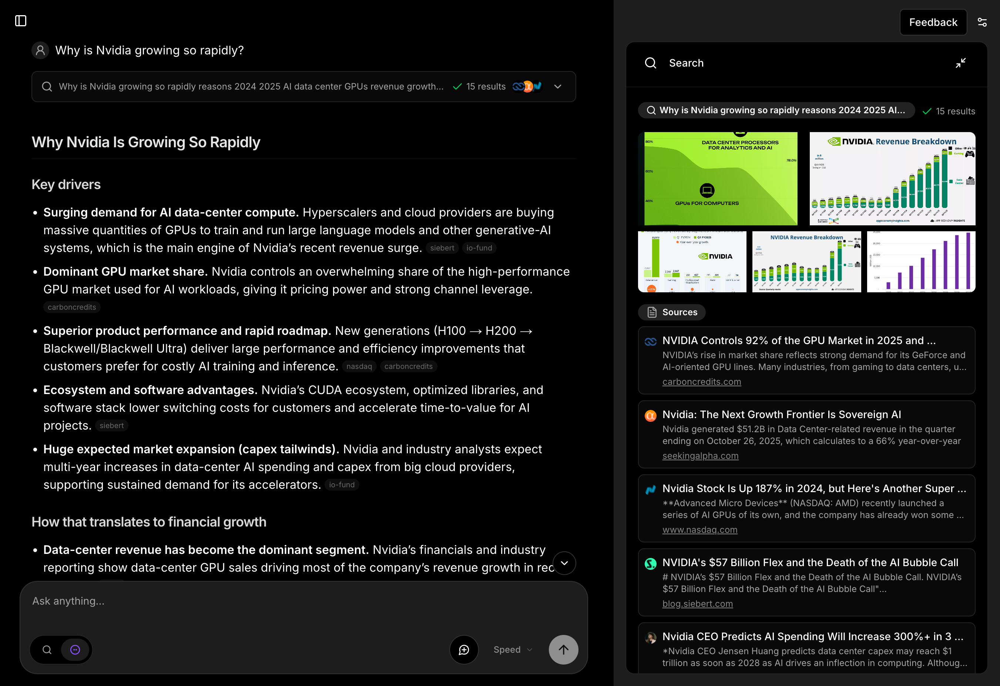

<div align="center">

# Morphic

一个具有生成式 UI 的 AI 驱动搜索引擎。

[![DeepWiki](https://img.shields.io/badge/DeepWiki-miurla%2Fmorphic-blue.svg?logo=data:image/png;base64,iVBORw0KGgoAAAANSUhEUgAAACwAAAAyCAYAAAAnWDnqAAAAAXNSR0IArs4c6QAAA05JREFUaEPtmUtyEzEQhtWTQyQLHNak2AB7ZnyXZMEjXMGeK/AIi+QuHrMnbChYY7MIh8g01fJoopFb0uhhEqqcbWTp06/uv1saEDv4O3n3dV60RfP947Mm9/SQc0ICFQgzfc4CYZoTPAswgSJCCUJUnAAoRHOAUOcATwbmVLWdGoH//PB8mnKqScAhsD0kYP3j/Yt5LPQe2KvcXmGvRHcDnpxfL2zOYJ1mFwrryWTz0advv1Ut4CJgf5uhDuDj5eUcAUoahrdY/56ebRWeraTjMt/00Sh3UDtjgHtQNHwcRGOC98BJEAEymycmYcWwOprTgcB6VZ5JK5TAJ+fXGLBm3FDAmn6oPPjR4rKCAoJCal2eAiQp2x0vxTPB3ALO2CRkwmDy5WohzBDwSEFKRwPbknEggCPB/imwrycgxX2NzoMCHhPkDwqYMr9tRcP5qNrMZHkVnOjRMWwLCcr8ohBVb1OMjxLwGCvjTikrsBOiA6fNyCrm8V1rP93iVPpwaE+gO0SsWmPiXB+jikdf6SizrT5qKasx5j8ABbHpFTx+vFXp9EnYQmLx02h1QTTrl6eDqxLnGjporxl3NL3agEvXdT0WmEost648sQOYAeJS9Q7bfUVoMGnjo4AZdUMQku50McDcMWcBPvr0SzbTAFDfvJqwLzgxwATnCgnp4wDl6Aa+Ax283gghmj+vj7feE2KBBRMW3FzOpLOADl0Isb5587h/U4gGvkt5v60Z1VLG8BhYjbzRwyQZemwAd6cCR5/XFWLYZRIMpX39AR0tjaGGiGzLVyhse5C9RKC6ai42ppWPKiBagOvaYk8lO7DajerabOZP46Lby5wKjw1HCRx7p9sVMOWGzb/vA1hwiWc6jm3MvQDTogQkiqIhJV0nBQBTU+3okKCFDy9WwferkHjtxib7t3xIUQtHxnIwtx4mpg26/HfwVNVDb4oI9RHmx5WGelRVlrtiw43zboCLaxv46AZeB3IlTkwouebTr1y2NjSpHz68WNFjHvupy3q8TFn3Hos2IAk4Ju5dCo8B3wP7VPr/FGaKiG+T+v+TQqIrOqMTL1VdWV1DdmcbO8KXBz6esmYWYKPwDL5b5FA1a0hwapHiom0r/cKaoqr+27/XcrS5UwSMbQAAAABJRU5ErkJggg==)](https://deepwiki.com/miurla/morphic) [](https://github.com/miurla/morphic/stargazers) [](https://github.com/miurla/morphic/network/members)

<a href="https://vercel.com/oss">
  
</a>

<br />
<br />

<a href="https://trendshift.io/repositories/9207" target="_blank"></a>



</div>

## 🗂️ 概述

- 🛠 [功能特性](#-功能特性)
- 🧱 [技术栈](#-技术栈)
- 🚀 [快速开始](#-快速开始)
- 🌐 [部署](#-部署)
- 👥 [贡献](#-贡献)
- 📄 [许可证](#-许可证)

📝 在 [DeepWiki](https://deepwiki.com/miurla/morphic) 上探索 AI 生成的文档

## 🛠 功能特性

### 核心功能

- AI 驱动的搜索与生成式 UI
- 自然语言问题理解
- 支持多个搜索提供商（Tavily、Brave、SearXNG、Exa）
- 搜索模式：快速、规划和自适应
- 模型类型选择：速度 vs 质量
- 检查器面板，用于工具执行和 AI 处理详情

### 身份验证

- 由 [Supabase Auth](https://supabase.com/docs/guides/auth) 提供支持的用户身份验证

### 访客模式

- 允许用户无需创建账户即可试用应用
- 访客不存储聊天历史（临时会话）
- 可选的 IP 地址每日速率限制
- 使用 `ENABLE_GUEST_CHAT=true` 启用

### 聊天与历史

- 聊天历史自动存储在 PostgreSQL 数据库中
- 通过唯一 URL 分享搜索结果
- 消息反馈系统
- 文件上传支持

### AI 提供商

- OpenAI（默认）
- Anthropic Claude
- Google Gemini
- Vercel AI Gateway
- Ollama

模型在 `config/models/*.json` 中配置，具有基于配置文件的设置。使用非 OpenAI 提供商时，请使用兼容的模型 ID 更新模型配置文件。详情请参阅[配置指南](docs/CONFIGURATION.md)。

### 搜索能力

- URL 特定搜索
- 使用 Tavily 或 Jina 进行内容提取
- 引用跟踪和显示
- 支持 SearXNG 的自托管搜索

### 附加功能

- Docker 部署就绪
- 浏览器搜索引擎集成
- 使用 Langfuse 进行 LLM 可观测性（可选）
- 复杂任务的待办事项跟踪

## 🧱 技术栈

### 核心框架

- [Next.js](https://nextjs.org/) - 带 App Router 的 React 框架
- [TypeScript](https://www.typescriptlang.org/) - 类型安全开发
- [Vercel AI SDK](https://ai-sdk.dev) - 用于构建 AI 驱动应用程序的 TypeScript 工具包

### 身份验证与授权

- [Supabase](https://supabase.com/) - 用户身份验证和后端服务

### AI 与搜索

- [OpenAI](https://openai.com/) - 默认 AI 提供商（可选：Google AI、Anthropic）
- [Tavily AI](https://tavily.com/) - 带上下文的 AI 优化搜索
- [Brave Search](https://brave.com/search/api/) - 传统网络搜索结果
- Tavily 替代方案：
  - [SearXNG](https://docs.searxng.org/) - 自托管搜索
  - [Exa](https://exa.ai/) - 基于嵌入的语义搜索
  - [Firecrawl](https://firecrawl.dev/) - 网络、新闻和图像搜索，支持爬取、抓取、LLM 就绪提取和[开源](https://github.com/firecrawl/firecrawl)。

### 数据存储

- [PostgreSQL](https://www.postgresql.org/) - 主数据库（支持 Neon、Supabase 或标准 PostgreSQL）
- [Drizzle ORM](https://orm.drizzle.team/) - 类型安全的数据库 ORM
- [Cloudflare R2](https://developers.cloudflare.com/r2/) - 文件存储（可选）

### UI 与样式

- [Tailwind CSS](https://tailwindcss.com/) - 实用优先的 CSS 框架
- [shadcn/ui](https://ui.shadcn.com/) - 可重用组件
- [Radix UI](https://www.radix-ui.com/) - 无样式、可访问的组件
- [Lucide Icons](https://lucide.dev/) - 美观且一致的图标

## 🚀 快速开始

### 1. Fork 并克隆仓库

将仓库 fork 到您的 Github 账户，然后运行以下命令克隆仓库：

```bash
git clone git@github.com:[YOUR_GITHUB_ACCOUNT]/morphic.git
```

### 2. 安装依赖

```bash
cd morphic
bun install
```

### 3. 配置环境变量

```bash
cp .env.local.example .env.local
```

在 `.env.local` 中填写所需的环境变量：

```bash
OPENAI_API_KEY=your_openai_key
TAVILY_API_KEY=your_tavily_key
```

### 4. 本地运行应用

```bash
bun dev
```

在浏览器中访问 http://localhost:3000。

**注意**：默认情况下，Morphic 在没有数据库或身份验证的情况下运行。要启用聊天历史、身份验证和其他功能，请参阅 [CONFIGURATION.md](./docs/CONFIGURATION.md)。有关 Docker 设置，请参阅 [Docker 指南](./docs/DOCKER.md)。

## 🌐 部署

使用 Vercel 或 Docker 托管您自己的 Morphic 实时版本。

### Vercel

[](https://vercel.com/new/clone?repository-url=https%3A%2F%2Fgithub.com%2Fmiurla%2Fmorphic&env=DATABASE_URL,OPENAI_API_KEY,TAVILY_API_KEY,BRAVE_SEARCH_API_KEY)

**注意**：对于 Vercel 部署，请设置 `ENABLE_AUTH=true` 并配置 Supabase 身份验证以确保部署安全。

### Docker

有关预构建镜像、Docker Compose 设置和部署说明，请参阅 [Docker 指南](./docs/DOCKER.md)。

## 👥 贡献

我们欢迎对 Morphic 的贡献！无论是错误报告、功能请求还是拉取请求，所有贡献都受到赞赏。

请参阅我们的[贡献指南](CONTRIBUTING.md)了解以下详情：

- 如何提交问题
- 如何提交拉取请求
- 提交消息约定
- 开发设置

## 📄 许可证

本项目采用 Apache License 2.0 许可 - 详情请参阅 [LICENSE](LICENSE) 文件。
